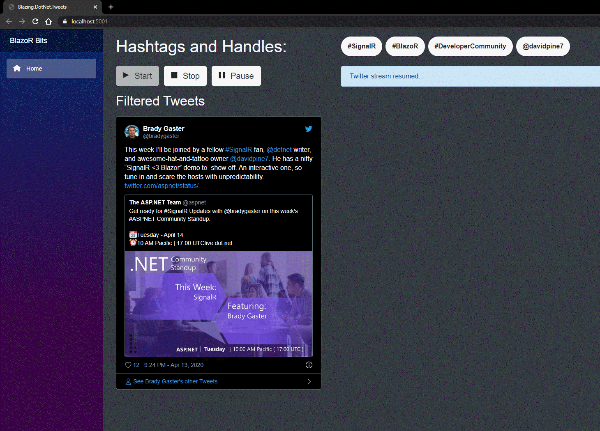

# Introduction

This application was written to demonstrate SignalR with [Blazor WebAssembly](https://devblogs.microsoft.com/aspnet/blazor-webassembly-3-2-0-preview-1-release-now-available/). It was inspired by the evolution of an earlier project of mine, which started with [Blazor.Extensions](https://github.com/BlazorExtensions) + [SignalR](https://github.com/BlazorExtensions/SignalR), before the official SignalR .NET client actually worked with Blazor. At a later time, the app was converted to no longer rely on *Blazor.Extensions*. Unfortunately it relies on a combination of JavaScript and the Azure SignalR service, [IEvangelist.BlazoR.TwitterStreaming](https://github.com/IEvangelist/IEvangelist.BlazoR.TwitterStreaming). Now, we're back to a more pure .NET solution...

Enjoy :metal:

# Accessing Twitter API

In order to access the Twitter API, you need a [Twitter developer account](https://developer.twitter.com/en/apps/create). Then you will need to specify several environment variables in order for this application to function appropriately.

- `Authentication__Twitter__AccessToken`
- `Authentication__Twitter__AccessTokenSecret`
- `Authentication__Twitter__ConsumerKey`
- `Authentication__Twitter__ConsumerSecret`

# Demo

